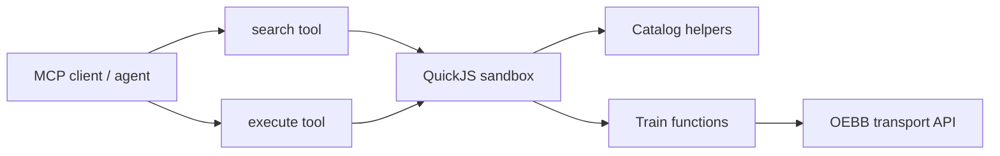

# train-mcp

MCP server for Austrian train planning where the agent writes JavaScript instead of only filling fixed JSON forms.

The server exposes a constrained `codemode` API inside an isolated QuickJS sandbox. The agent can write small scripts that search stations, inspect intermediate results, chain journey calls, filter alternatives, and return a shaped answer. The sandbox has no general network or filesystem access; it can only call the train-planning functions exposed by the MCP server.

## Architecture



## MCP tools

`train-mcp` exposes exactly two MCP tools:

- `search`: catalog-only JavaScript execution. Use it to discover available train functions and their input schemas.
- `execute`: train-planning JavaScript execution. Use it to call OEBB-backed train functions.

Both tools accept one input field:

```json
{
  "code": "return await codemode.listTools({});"
}
```

## `search`

`search` only exposes catalog helpers:

- `codemode.getCatalog({})`
- `codemode.listTools({})`

Example:

```js
const tools = await codemode.listTools({});
return tools;
```

## `execute`

`execute` exposes the actual train functions:

- `codemode.oebbPlanJourney(...)`
- `codemode.oebbPlanTour(...)`
- `codemode.oebbResolveItineraryStops(...)`
- `codemode.oebbLocations(...)`
- `codemode.oebbDepartures(...)`
- `codemode.oebbJourneys(...)`
- `codemode.oebbTrip(...)`

Call functions directly on `codemode`. Do not use `codemode.callTool(...)`.

Example:

```js
const journey = await codemode.oebbPlanJourney({
  from: "Wien Hbf",
  to: "Linz Hbf",
  departure: "2026-05-11T09:00:00+02:00",
  results: 1,
  responseMode: "summary"
});

return journey;
```

Because this is JavaScript, the agent can do multi-step work in one tool call:

```js
const from = await codemode.oebbLocations({ query: "Wien Hbf", results: 3 });
const to = await codemode.oebbLocations({ query: "Linz Hbf", results: 3 });

const journey = await codemode.oebbPlanJourney({
  from: from[0].id,
  to: to[0].id,
  departure: "2026-05-11T09:00:00+02:00",
  results: 3,
  selection: "fastest",
  responseMode: "summary"
});

return {
  resolved: { from: from[0], to: to[0] },
  journey
};
```

## Connect

Codex CLI:

```bash
codex mcp add train-mcp --url https://train.floritzmaier.xyz/mcp
```

Claude Code:

```bash
claude mcp add --transport http train-mcp https://train.floritzmaier.xyz/mcp
```

Local development:

```bash
cd mcp
cargo run
```
